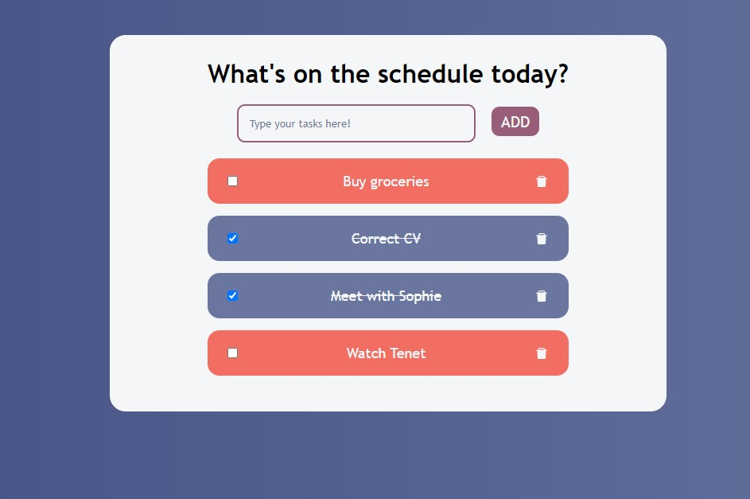

# TODO List - React application
Simple application for a TODO list made using React.
Part of an EESTEC International IT Team React course.

This simple application allows it's users to add, delete tasks and mark them as done or undone. 

# Licence
[MIT Licence](https://opensource.org/licenses/MIT)
